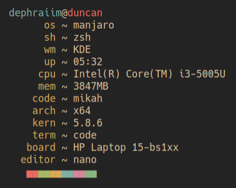

# sysinfo

A system information tool written with JavaScript

### Installation
If you have `npm`, you can ran
```bash
npm install -g sysinfo
```
OR
```bash
npx sysinfo
```

Without `npm`
```bash
$ curl -sL install-sysinfo.now.sh | sh

# Requires "Administrative Rights"
```

### Build
```bash
# nodejs and npm must be installed
git clone https://github.com/dephraiim/sysinfo.git
cd sysinfo
npm install
npm run build
```

### Demo


